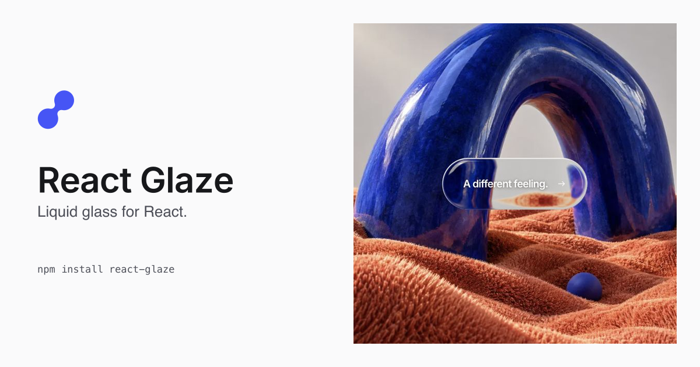

[](https://react-glaze.vercel.app/)

[Website](https://react-glaze.vercel.app/) · [Playground](https://react-glaze.vercel.app/playground) · [Showcase](https://react-glaze.vercel.app/showcase) · [npm](https://www.npmjs.com/package/react-glaze)

A configurable React 19 component that refracts the page behind your content. Use a native button, link or ordinary wrapper, keep your own CSS, and adjust the material, shape and optional pointer-driven rim light.

**Experimental.** Desktop Chrome, Firefox and Safari are the targets; iPhone Safari is experimental. Background capture is asynchronous and has [documented limitations](packages/react/README.md#known-limits).

## Install

```sh
npm install react-glaze
```

```tsx
'use client';

import { LiquidGlass } from 'react-glaze';

export function SaveButton() {
  return (
    <LiquidGlass
      as="button"
      preset="quiet"
      shape="pill"
      rimLight={{ onLeave: 'hold' }}
      style={{ padding: '12px 24px' }}
      onClick={() => console.log('Saved')}
    >
      Save this moment
    </LiquidGlass>
  );
}
```

No provider, background image prop or stylesheet import is required. Your content controls the size; your CSS controls layout and typography. Next.js App Router can render the library's client boundary from a server component. Event handlers belong in your own client component.

## Customize

- **Materials:** reference, quiet, frosted and Optical Type presets, with individual optical controls.
- **Shapes:** rounded surfaces, pills, circles and lenses, plus caller-defined CSS corners.
- **Foreground:** sharp native content by default; refracted content is experimental.
- **Rim light:** optional static or nearby-pointer light. Choose `onLeave: 'return'` or `'hold'` and adjust strength, width, reach and response. Touch and reduced motion keep a fixed upper-left light.

[Full component API](packages/react/README.md) · [Adoption guide](docs/adoption.md)

## Try locally

Use Node.js 24 or newer:

```sh
pnpm install --frozen-lockfile
pnpm dev
```

Open http://127.0.0.1:8862. One Next.js app serves the landing page, `/playground` and `/showcase`.

The playground includes material/rim controls, custom backgrounds, generated JSX/JSON and shareable URLs. Save one configuration locally for your next visit; explicit shared URLs take priority. Uploaded images stay in the current tab. Saved configurations belong to the browser origin; using the same host and port as the previous preview preserves access to them.

The Roam showcase exercises responsive photographs, image changes, navigation, native dialogs and trip planning over real page content. Its saved trips stay local to your browser.

## Develop and verify

```sh
pnpm check
pnpm pack:local
```

`packages/react` contains the library. `apps/demo` is a Next.js consumer pinned to the published `react-glaze@0.1.1` package. Its import resolves to the registry package, while the local library is built and tested separately. The workspace uses one pnpm lockfile.

Checks cover package tests and public types, playground configuration/storage tests, workspace type checks and the demo production build. Local archives are written to unique directories so previous builds remain available. See the [demo guide](apps/demo/README.md) for routes and styling, and the [design lock](docs/design-locks/2026-09-09-demo.md) for the landing direction and verification record.

[Contributing](CONTRIBUTING.md) · [Release procedure](docs/releasing.md) · [Issues](https://github.com/Stianlars1/react-glaze/issues)

## License and credits

[MIT](LICENSE), © Stian Larsen. The optical material and original Optical Type artwork derive from the MIT-licensed [Drawn To](https://github.com/Stianlars1/drawn-to) reference. [Third-party notices](packages/react/THIRD-PARTY-NOTICES.md) include Drawn To, Three.js and html-to-image. Fonts retain their OFL notices; showcase photographs retain [source credits](apps/demo/ASSETS.md).

React Glaze is an independent project and is not affiliated with Apple or Raycast.
