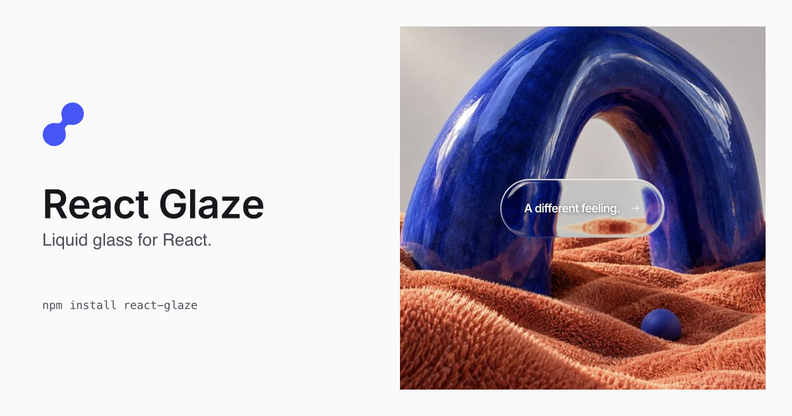

[](https://react-glaze.app/)

[Website](https://react-glaze.app/) · [Components](https://react-glaze.app/components) · [Liquid Glass editor](https://react-glaze.app/components?component=glass) · [Showcase](https://react-glaze.app/showcase) · [npm](https://www.npmjs.com/package/react-glaze)

An open-source React 19 component library for liquid glass: a configurable wrapper, morphing menus, spring-driven actions and composable surfaces. Keep native content and your own CSS, and tune the material and motion.

| Component | Use it for |
| --- | --- |
| `LiquidGlass` | Wrap existing buttons, cards and other native content in configurable glass |
| `LiquidGlassActions` | Open separate action buttons in a row, column or fan |
| `LiquidGlassMenu` | Morph a trigger into a menu panel |
| `LiquidGlassGroup` | Coordinate the shared glass and motion of custom surfaces |
| `LiquidGlassSurface` | Bind native content to a surface inside a group |

Start with the three ready-made components, or compose your own interactions with the group and surface primitives. All five exports come from `react-glaze`.

**Experimental.** Desktop Chrome, Firefox and Safari are the targets; iPhone Safari is experimental. Background capture is asynchronous and has [documented limitations](packages/react/README.md#known-limits).

## Install

```sh
npm install react-glaze
```

```tsx
'use client';

import { LiquidGlass } from 'react-glaze';

export function SaveButton() {
  return (
    <LiquidGlass
      as="button"
      preset="quiet"
      shape="pill"
      rimLight={{ onLeave: 'hold' }}
      style={{ padding: '12px 24px' }}
      onClick={() => console.log('Saved')}
    >
      Save this moment
    </LiquidGlass>
  );
}
```

No provider, background image prop or stylesheet import is required. Your content controls the size; your CSS controls layout and typography. Next.js App Router can render the library's client boundary from a server component. Event handlers belong in your own client component.

## Morphing components

`LiquidGlassActions` opens a row, column or fan of native buttons. `LiquidGlassMenu` turns one trigger into a menu panel. Both use `LiquidGlassGroup` and `LiquidGlassSurface`, which are also available for building your own interactions. Adjust action size, signed trigger distance, connection reach, refraction, exact duration and bounce independently.

The Components editor includes animation playback: pause, play, replay and scrub the actual spring animation, then tune the material on the held frame. Menu and group refs expose the same playback methods for your own tooling.

[Component guide and examples](docs/components.md) · [Interactive components](https://react-glaze.app/components)

## Customize

- **Materials:** reference, quiet, frosted and Optical Type presets, with individual optical controls.
- **Shapes:** rounded surfaces, pills, circles and lenses, plus caller-defined CSS corners.
- **Foreground:** sharp native content by default; refracted content is experimental.
- **Rim light:** optional static or nearby-pointer light. Choose `onLeave: 'return'` or `'hold'` and adjust strength, width, reach and response. Touch and reduced motion keep a fixed upper-left light.

[Full component API](packages/react/README.md) · [Adoption guide](docs/adoption.md)

## Try locally

Use Node.js 24 or newer:

```sh
pnpm install --frozen-lockfile
pnpm --filter react-glaze build
pnpm dev
```

Open http://127.0.0.1:8862. One Next.js app serves the landing page, `/components` and `/showcase`. `/playground` remains a compatibility redirect to `/components?component=glass`.

The Liquid Glass editor at `/components?component=glass` includes material/rim controls, custom backgrounds, generated JSX/JSON and shareable URLs. Save one configuration locally for your next visit; explicit shared URLs take priority. Uploaded images stay in the current tab. Saved configurations belong to the browser origin; using the same host and port as the previous preview preserves access to them.

The Roam showcase exercises responsive photographs, image changes, navigation, native dialogs and trip planning over real page content. Its saved trips stay local to your browser.

## Develop and verify

```sh
pnpm check
pnpm pack:local
```

`packages/react` contains the library. `apps/demo` consumes its built workspace package during development and CI. An independently installed tarball consumer verifies the distributable boundary separately. The workspace uses one pnpm lockfile. Build the package before starting the demo after library changes.

Checks cover package tests and public types, playground configuration/storage tests, workspace type checks and the demo production build. Local archives are written to unique directories so previous builds remain available. See the [demo guide](apps/demo/README.md) for routes and styling, and the [design lock](docs/design-locks/2026-09-09-demo.md) for the landing direction and verification record.

[Contributing](CONTRIBUTING.md) · [Release procedure](docs/releasing.md) · [Brand assets](apps/demo/docs/brand.md) · [Issues](https://github.com/Stianlars1/react-glaze/issues)

## License and credits

[MIT](LICENSE), © Stian Larsen. The optical material and original Optical Type artwork derive from the MIT-licensed [Drawn To](https://github.com/Stianlars1/drawn-to) reference. [Third-party notices](packages/react/THIRD-PARTY-NOTICES.md) include Drawn To, Three.js and html-to-image. Fonts retain their OFL notices; showcase photographs retain [source credits](apps/demo/ASSETS.md).

React Glaze is an independent project and is not affiliated with Apple or Raycast.
